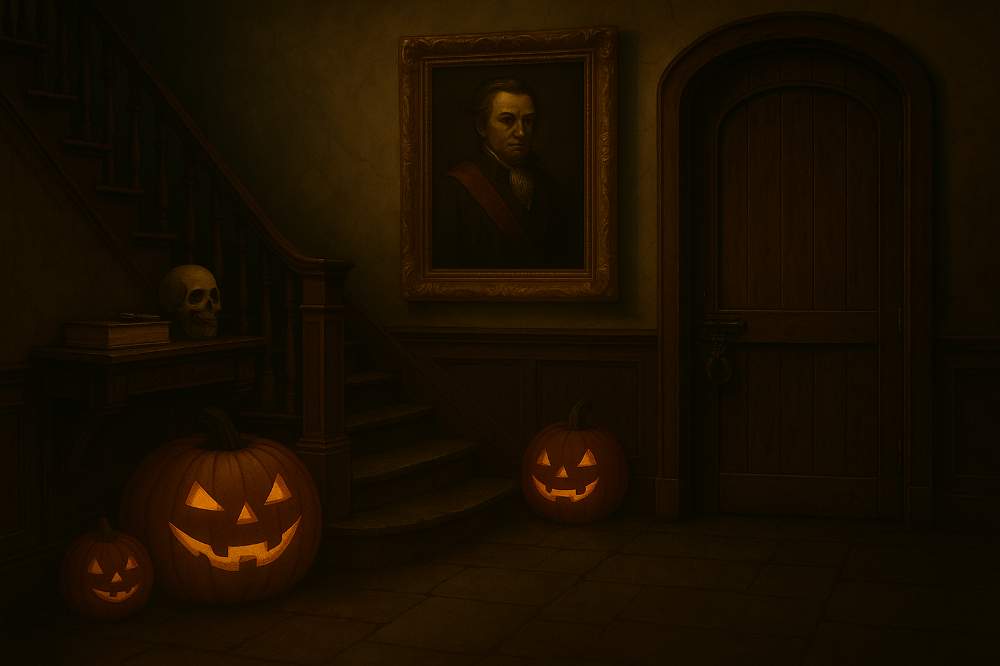

  

#  MindTrap: Escape the Haunted Mansion

> _“Sometimes, the door you fear to open… is the one that sets you free.”_

**MindTrap** is a short interactive point-and-click escape game created for the **Halloween Hackathon 2025**, where players explore a haunted mansion, uncover clues, and find the key to escape.

---

## 🖼️ Screenshots

| Landing Page | Foyer | Living Room | Basement |
|:--|:--|:--|:--|
|  |  |  |  |

---

## 🎮 How to Play

### 1️⃣ Enter the Mansion
Step inside the eerie old manor—but beware!  
As soon as you cross the threshold, the **front door locks behind you**. You begin in the **foyer**.

### 2️⃣ Explore the Rooms
Venture into the **living room**, where you’ll discover a **mysterious chest**.  
It’s locked and demands a secret code.

### 3️⃣ Search for Clues
Return to the **foyer** and investigate.  
Behind the dusty **painting**, you’ll find a cryptic inscription:  
> **“B4SE”**

### 4️⃣ Unlock the Chest
Use the code **B4SE** to open the chest. Inside lies an **ancient scroll** with a riddle:

> “Below where shadows breathe and creep,  
> Lies the path the living keep.  
> Doors above will never free,  
> Your way out waits beneath, with me.”

The message reveals your only escape lies in the **basement**.

### 5️⃣ Find the Basement Door
Descend into the **spooky basement**, where darkness thickens.  
The final exit door is locked tight.

### 6️⃣ Locate the Key
Search the rooms once more. In the **foyer**, you’ll discover the **rusty key** that fits the basement lock.

### 7️⃣ Escape!
Use the key to open the **basement door** and escape the haunted mansion—  
_if you dare._

---

## 🧩 Game Features

- 🕹️ Interactive point-and-click gameplay  
- 🎧 Ambient background audio & custom sound effects  
- 🪞 Inventory and item usage system  
- 💡 Hint system (press **H**)  
- 🧠 Autosave + manual save (**S**)  
- ♿ Keyboard & screen-reader accessible (ARIA roles, focus traps)  
- ⚙️ Settings for sound, text speed, and reduced jumpscares  
- 🔋 Offline play (PWA-ready manifest + service worker)  

---

## 🧠 Tech Stack

- **Frontend:** HTML5, CSS3, JavaScript (vanilla ES6)
- **Audio:** Web Audio API (ambient + SFX)
- **Storage:** LocalStorage (autosave)
- **Accessibility:** Keyboard navigation, ARIA roles, focus control

---

## 🌐 Deployment

GitHub Pages

This project was deployed using GitHub Pages from the main branch.
Navigate to the repository on GitHub.
Click on the Settings tab.
Scroll down to the Pages section (under Code and Automation).
Under Source, select the Main branch and the /(root) folder.
Click Save.
After a few moments, the site will be published and the live link will appear at the top of the Pages section.
🔗 Live Site: 

Forking the Repository

To create a personal copy of this project:
Go to the MindTrap Repository
Click the Fork button in the top-right corner.
This will create a copy of the repo in your own GitHub account for personal use or modification.

Cloning the Repository

To clone this project locally:
On the repository page, click the Code button.
Copy the HTTPS or SSH link.
Open your IDE terminal and run:
git clone 

Press Enter, and the repository will be cloned to your local machine.

Local Deployment

To run the game locally:
Open the cloned project folder in your IDE.
Ensure all assets (HTML, CSS, JS, images, and audio files) are in their correct paths.
Open the index.html file in your browser.

Enjoy the full interactive experience.

---

## 🏆 Hackathon Info

**Event:** Halloween Hackathon 2025  
**Participants:** Fatima, Inekwe, Chaz & Mubashir
**Category:** Game Design & Web Interactivity  
**Result:** _Successfully deployed playable web app + PWA version_

---

## 🙌 Special Thanks

- 🎭 The hackathon organizers for the spooky inspiration  
- 🕯️ Our playtesters who dared to enter the mansion  
- 💀 The brave souls who discovered the **B4SE** code before dawn  

---

